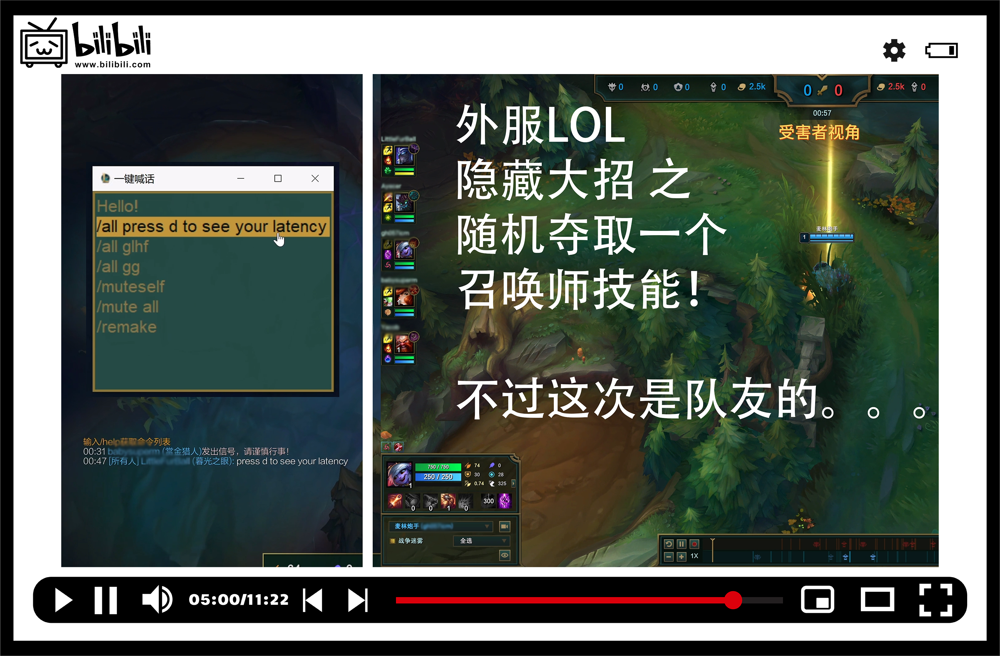
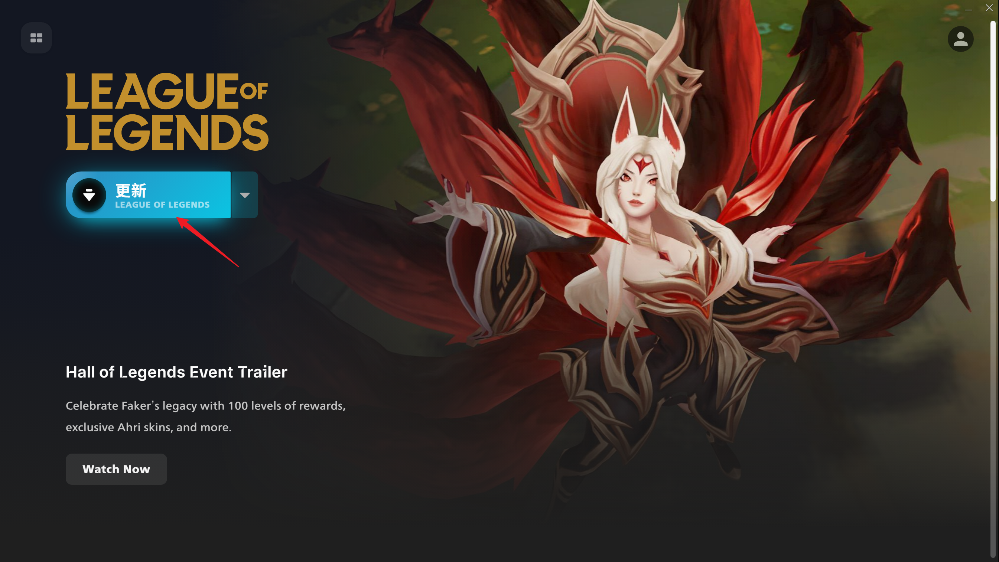
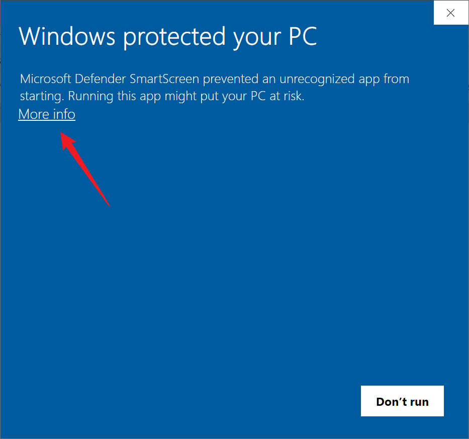
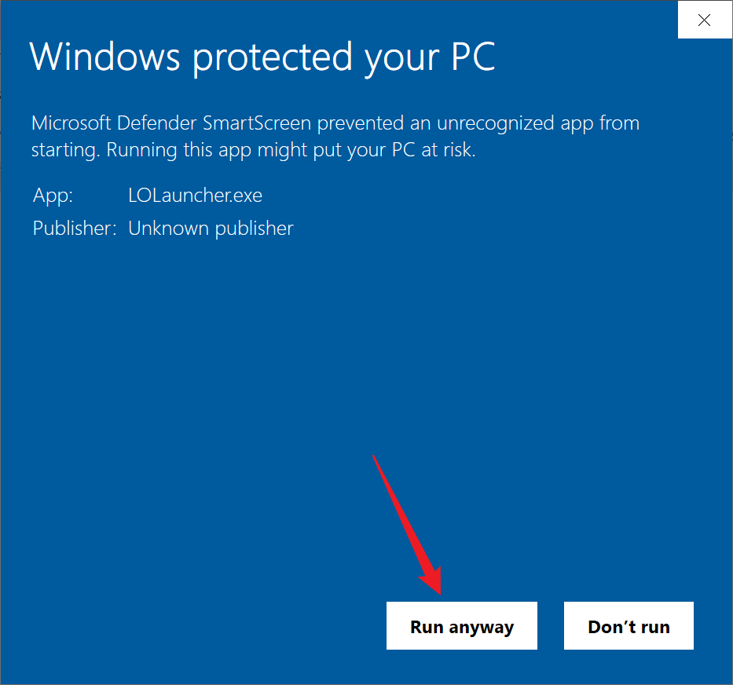

<p align="center">
    
</p>

<div align="center">


[](https://github.com/ChenglongMa/LOLauncher/releases/latest)
[](https://github.com/ChenglongMa/LOLauncher/blob/main/LICENSE)
[](https://www.bilibili.com/video/BV1hf421D7zc/?share_source=copy_web&vd_source=cc52ec064b8a1a36acc686a244981a42)
[](https://www.bilibili.com/video/BV1Zs421P7EB)
[](https://github.com/ChenglongMa/LOLauncher/releases/latest)

</div>

# 英雄联盟，启动！

* 该程序用于修改英雄联盟的文本语言为**简体中文**，语音为**国服语音**，并启动游戏。
* 当然你也可以参考 [下方配置文件章节](#配置文件) 将其改为其他语言。
* 该程序**目前**在 Windows 系统下测试通过。MacOS 版本正在开发中。
* 该程序目前适用于英雄联盟的14.9版本，特别是 [Riot Vanguard](https://www.leagueoflegends.com/en-us/news/game-updates/patch-14-9-notes/#patch-vanguard) 发布后，以前的修改语言的方法已经失效。

_如何您喜欢该项目，欢迎点一个⭐！_

_如果您有任何问题，请在 [Discussions](https://github.com/ChenglongMa/LOLauncher/discussions) 或 [Issues](https://github.com/ChenglongMa/LOLauncher/issues) 中讨论，也可以给我发邮件 [chenglong.m_at_outlook.com](mailto:chenglong.m@outlook.com)。_

_谢谢关注！_

## 视频教程

_B站视频被下架了，改换 YouTube..._

[](https://youtu.be/_kph7Sua8Dw)

## 安装并运行

1. 前往 [Release 页面](https://github.com/ChenglongMa/LOLauncher/releases/latest) 下载最新版本的 [LOLauncher.zip](https://github.com/ChenglongMa/LOLauncher/releases/latest/download/LOLauncher.zip)。
2. 解压缩 `LOLauncher.zip` 到任意目录。
3. 运行 `LOLauncher.exe`。

该程序会自动检测英雄联盟的相关目录修改配置并启动游戏。

## 版本比较

| 版本号       | [v1.0.1](https://github.com/ChenglongMa/LOLauncher/releases/tag/1.0.1) | [v1.0.2](https://github.com/ChenglongMa/LOLauncher/releases/tag/1.0.2) |
|-----------|------------------------------------------------------------------------|------------------------------------------------------------------------|
| Win 10 适用 | ✔                                                                      | ✔                                                                      |
| Win 11 适用 | X                                                                      | ✔                                                                      |
| 管理员权限     | ✔                                                                      | X                                                                      |
| 后台运行      | X                                                                      | ✔                                                                      |
| 自动更新      | ✔                                                                      | ✔                                                                      |


### 注意 
1. ~~该程序需要**管理员权限**运行。这是因为需要将游戏的配置文件设置为只读，以防止游戏更新后恢复默认语言。~~
   * 自 1.0.2 版本开始，不再需要管理员权限。
2. ~~游戏启动成功后**不需要**再次运行该程序，可按照您的习惯启动游戏。若之后游戏更新导致语言恢复，可重新运行该程序。~~
   * 自 1.0.2 版本开始，程序需要保持后台运行，直到游戏启动，以便在游戏更新后自动修改语言。
   * 您依然可以按照您的习惯启动游戏，但是请不要关闭该程序。
3. 本程序会**自动检查更新**，如果有新版本会提示您下载。我会根据游戏的更新情况及时更新程序。

> [!TIP]
> 
> 如果您想要完整的翻译, 请在打开游戏后先**关闭一次**, 然后会弹出以下界面:
> 
> 
> 
> 请**毫不犹豫**地点击 `更新` 按钮!
> 
> 之后进入游戏就会看到完整的翻译了 🍻
> 
> (比较遗憾的是, 该操作目前无法通过程序自动完成, 且下次启动会失效, 但是我会尽快想办法更新程序以支持该功能)

*如果你想手动配置相关文件路径，可以参考以下文档：*

## 配置文件

首次运行程序后，会在`C:\Users\<你的用户名>\.lolauncher`下生成 `config.json` 文件，你可以在该文件中手动配置相关路径。

```json
{
  "SettingFile": "C:\\ProgramData\\Riot Games\\Metadata\\league_of_legends.live\\league_of_legends.live.product_settings.yaml",
  "GameClient": "C:/Games/Riot Games/Riot Client/RiotClientServices.exe",
  "Locale": "zh_CN"
}
```

- `SettingFile`：英雄联盟的 `league_of_legends.live.product_settings.yaml` 配置文件路径。
- `GameClient`：Riot 客户端的 `RiotClientServices.exe` 文件路径。
- `Locale`：游戏语言，例如 `zh_CN` 为中文，`en_US` 为英文。
- **注意：路径中的 `\` 需要替换为 `\\`，或者使用 `/` （请参考以上示例）。**

## 声明

本项目是一个用于修改英雄联盟的文本语言和语音的工具，其目的是为了提供一个更好的游戏体验。它并不修改游戏的任何核心文件或者影响游戏的任何机制，也不提供任何形式的不公平优势。

与此相反，游戏作弊器通常会修改游戏的核心文件，或者以某种方式影响游戏的机制，以提供不公平的优势。这种行为不仅违反了游戏的服务条款，也破坏了游戏的公平性和玩家的游戏体验。

因此，LOLauncher与游戏作弊器在本质上是完全不同的。请放心使用。🖖

## 常见问题

### 1. 程序失效，游戏语言未修改成功。

**解决方案**：您可以参考视频教程 [](https://youtu.be/gNkLY6EAsaU?si=Q-WdWD7Jt7Oyik_w) 或 [](https://www.bilibili.com/video/BV1Zs421P7EB) 手动修改游戏语言。

如果依然有问题，请在 [Discussions](https://github.com/ChenglongMa/LOLauncher/discussions) 或 [Issues](https://github.com/ChenglongMa/LOLauncher/issues) 中讨论，也可以给我发邮件 [chenglong.m_at_outlook.com](mailto:chenglong.m@outlook.com)。

### 2. 运行程序时弹出 `Windows Defender 防病毒` 警告。

**解决方案**：这是由于该程序没有签名导致的。该程序代码完全开源，只是数字证书太贵了，我无力购买🥺。

如果您信任该程序，请点击 `More info`（`更多信息`），然后点击 `Run anyway`（`仍要运行`）。

该操作只需一次，后续不会再弹出警告。



