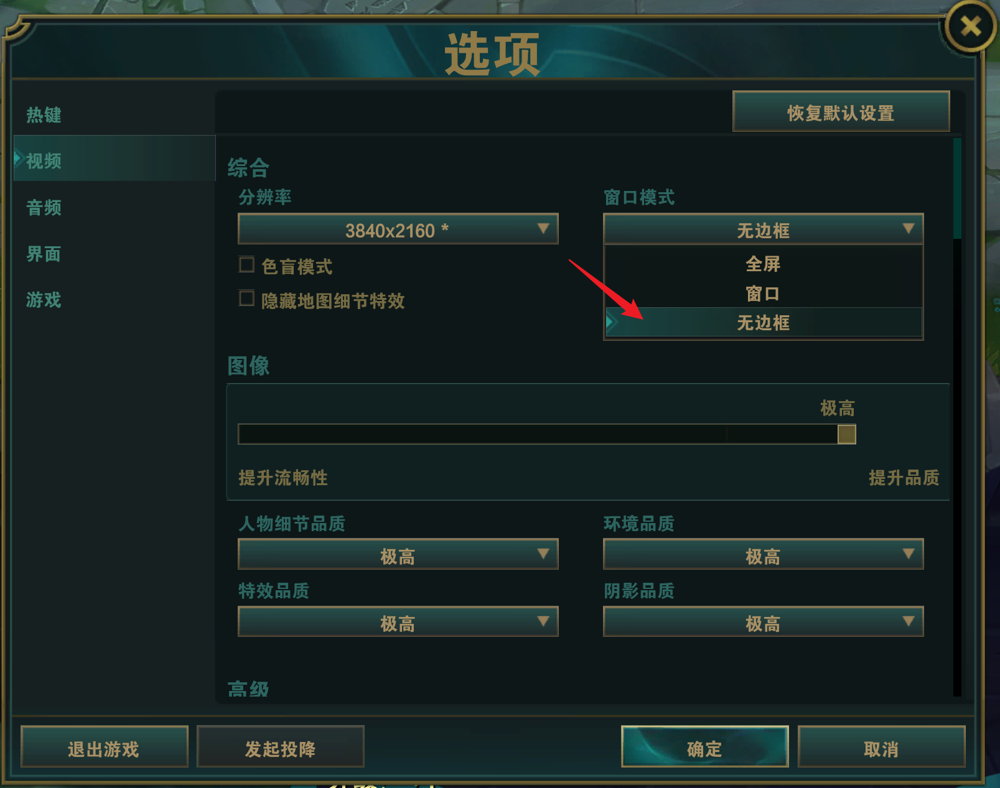

# 一键喊话功能的注意事项

## 太长不看版

1. 请将游戏窗口模式设置为**无边框全屏**。
2. 使用`一键喊话`前请确保聊天框处于**关闭**状态。
3. 开启`一键喊话`后建议先开一局自定义或训练模式测试一下。

## 详细版

### 1. 游戏窗口设置

请将游戏窗口模式设置为**无边框全屏**，以确保`一键喊话`功能正常工作。

#### 设置方法

#### 这样做的原因

游戏的**全屏**模式是一种**独占全屏模式(FSE)**，在该模式下调出其他窗口会导致游戏**最小化**，并回到桌面。

这种“坑队友”的行为是万万不可接受的。

而**无边框全屏**模式则是一种**窗口化全屏模式**，在该模式下调出其他窗口不会导致游戏**最小化**，而是保持在屏幕上。

技术上讲，利用 DirectX 或者 Windows Hook API 可以实现在**全屏**模式下调出其他窗口不会导致游戏**最小化**，
但是这种方式可能会被游戏防作弊系统识别为作弊行为。

所以权衡之下，我们选择了**无边框全屏**模式。

### 2. 使用前的准备

请确保聊天框处于**关闭**状态，以确保`一键喊话`功能正常工作。

该功能会默认聊天框处于**关闭**状态，由于目前没有找到合适的方法检测聊天框的开关状态，所以请手动关闭聊天框。

我会在后续版本中尽量解决这个问题。

### 3. 测试

为确保您充分了解并熟悉`一键喊话`功能，同时确保您喜欢这样的交互方式，
建议您先开一局自定义或训练模式测试一下。

## 结语

希望您能喜欢这个功能，同时也希望您能在游戏中保持友好的交流，共同创造一个良好的游戏环境。

如果您有任何问题或建议，请随时联系我，我会尽力解决您的问题。

祝您游戏愉快！🎮

该文档最后更新于 2024 年 06 月 25 日。

请访问 [GitHub 文档](https://github.com/ChenglongMa/LOLauncher/blob/main/docs/notes_on_quick_chat.md) 查看最新版本。

----

马成龙

我的联系方式：

- 个人主页：[https://chenglongma.com/](https://chenglongma.com/)
- GitHub：[ChenglongMa/LOLauncher](https://github.com/ChenglongMa/LOLauncher)
- 邮箱：[chenglong.m@outlook.com](mailto:chenglong.m@outlook.com)
- B站：[粉紅恶魔派大星](https://space.bilibili.com/3546378431105317/)
- 小红书：[粉红恶魔派大星](https://www.xiaohongshu.com/user/profile/565953ca82718c66a9cad92a)
- YouTube：[Chenglong Ma](https://www.youtube.com/@chenglongm)

